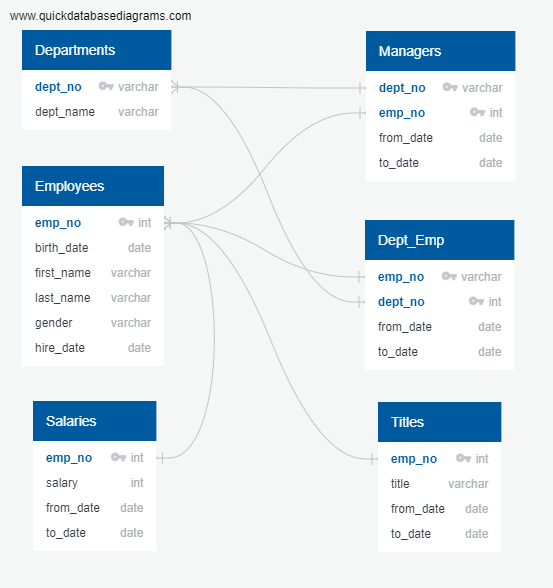
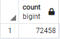
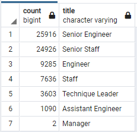

# Pewlett Hackard Analysis

## Overview
Pewlett Hackard is on the verge of experiencing a “silver tsunami”, in which a large set of its employees are nearing retirement age. These current employees are categorized as individuals being born between January 1, 1952 and December 31, 1955. The firm has asked for an in-depth analysis to determine the individuals, departments, and roles that as a whole will be affected by the large influx of retirees.

In order to address this growing issue, we have been asked to utilize SQL to create a number of datasets to populate and reflect which employees under departments or specific titles will be approaching retirement age soon. Utilizing this information, the firm also has a desire to establish a mentorship program to help build up existing employees to the senior roles that will be vacated soon. With the baby boomer generation reaching retirement age within the next few years, it is critical to determine and project a future outlook for the well-being of Pewlett Hackard. 

## Results
Before diving into the creation of table and their analysis, the following Entity Relationship Diagram (ERD) was created to understand the visual relationship of multiple tables we were given prior to diving into the exploratory and organization portion of the analysis.
Viewing the below image, we have mapped out a detailed flowchart the varying relationships held by each table and shared column. Based on the original csv files initially provided, we are able to capture primary and foreign keys of the flowcharts and the data types per each column. Through the assistance of the ERD, two analysis deliverables were established that will help managers prepare for the upcoming “silver tsunami”. 

### Amount of Retirees
There are a large amount of retirees that as of right now reach eligibility for retirement and could retire at any given moment. In total there are 72,458 employees who are now deemed in the stage to retire, which could create a large vacancy within the firm. 

### Senior Positions
Nearly the total set of individuals who occupy senior titles are the ones who largely fall under the upcoming retirement boom. These individual would be those who hold Senior Engineer and Senior Staff titles. Out of the 72,458 retirees, 50,842 or approximately 70.2% of the individuals on the retiring eligibility analysis are those who hold senior leadership titles. With a large influx of them potentially leaving, the firm will need to look to grow and build out their senior roles as soon as possible.

### Mid/Entry Level Positions
It can also be noted that that the remaining individuals who could now retire hold mid to entry level positions make a total of 29.8% of the individuals potentially retiring soon. In total, this combines to 21,616 employees. While they do not make up the majority of those retiring, it is important that the firm either helps to grow and promote internally or outsource and put out more hiring posts to help fulfill these roles to help support senior roles.  

### Mentorship Eligibility 
By combining through the analysis, there are a total of 300,024 employees at Pewlett Hackard, and from these, there are only a total of 1,549 employees whose birth year is 1965 and can qualify for the mentorship program. This signifies that 0.51% of the firm’s current total employees based on the parameters set in this deliverable qualify to take part in this program. 

## Summary
### How many roles will need to be filled as the "silver tsunami" begins to make an impact?
In total, there are 72,458 roles that will need to be filled as the “silver tsunami” makes an impact across the Pewlett Hackard firm. While there is a total of 300,024 employees, this signifies that approximately 24.1%, nearly one-quarter of the total workforce at Pewlett, will be leaving. 

